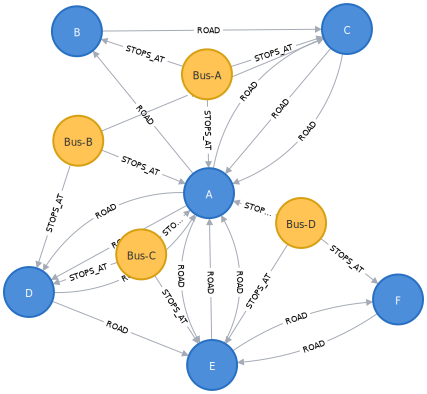
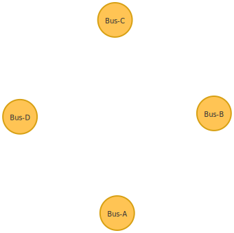
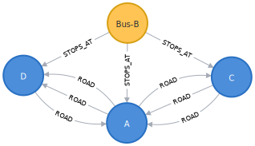
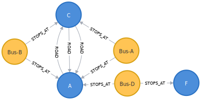
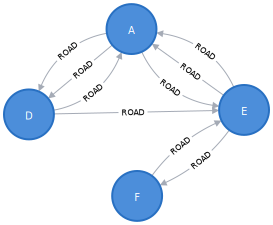
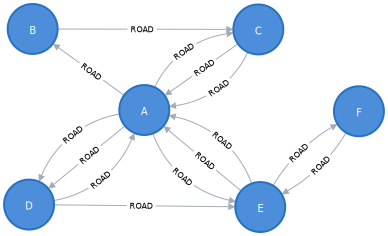
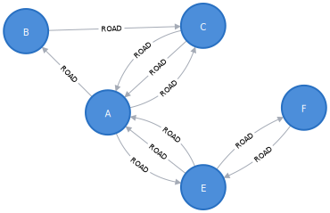

# Neo4j

## Užduotis

Parašyti paprastą programą įgyvendinančią sritį tinkamą grafų duomenų bazėms.

1. Sumodeliuokite bent kelias esybes su savybėmis.
2. Pademonstruokite prasmingas užklausas:
   1. Surasti esybes pagal savybę (pvz. rasti asmenį pagal asmens kodą, rasti banko sąskaitą pagal numerį).
   2. Surasti esybes pagal ryšį (pvz. banko sąskaitas priklausančias asmeniui, banko korteles susietas su konkretaus asmens sąskaitomis).
   3. Surasti esybes susietas giliais sąryšiais (pvz. draugų draugus, visus kelius tarp Vilniaus ir Klaipėdos; visus autobusus kuriais galima nuvažiuoti iš stotelės X į stotelę Y).
   4. Surasti trumpiausią kelią (pvz. surasti trumpiausią kelią tarp Vilniaus ir Klaipėdos; surasti pigiausią būdą konvertuoti iš valiutos X į valiutą Y, kuomet turima visų bankų konversijos informacija ir optimalus būdas, gali būti atlikti kelis žingsnius).
   5. Agreguojami duomenys (pvz. kaip 2.4, tik surasti kelio ilgį ar konversijos kainą). Nenaudokite trumpiausio kelio.

Paprastumo dėlei, būkite pasiruošę testinius duomenis. Programa turėtų leisti atlikti užklausas (tarkime įvedamas miestas X, miestas Y ir suplanuojamas kelias tarp jų).

---

## Prerequisites

- Install [node.js](https://nodejs.org/en/)
- Install [neo4j](https://formulae.brew.sh/cask/neo4j): `brew install neo4j`
- Install [neo4j Desktop](https://neo4j.com/download/)
  - Launch **neo4j Desktop** and create a project and a database
  - Install **APOC**, **Graph Data Science Library**, **Neo4j Streams** plugins

## Launch program

1. Launch **neo4J Desktop** and start project server manually.
2. Install npm modules: `npm install`
3. Execute the program: `npm run start`

---

## 0. Database content

```sql
MATCH (n) RETURN n
```



---

## 1. Find busses by name

```sql
MATCH (bus:Bus {name:'Bus-A'})
RETURN bus
```

```javascript
// 1. Find busses by name 'Bus-A':
[ 'Bus-A' ]
```


---

## 2. Find busses by partial name

```sql
MATCH (bus:Bus) WHERE bus.name CONTAINS 'Bus-'
RETURN bus
```

```javascript
// 2. Find busses by partial name 'Bus-':
[ 'Bus-A', 'Bus-B', 'Bus-C', 'Bus-D' ]
```



---

## 3. Find bus stops for a bus

```sql
MATCH cities = (bus:Bus {name: 'Bus-B'}) -[:STOPS_AT]- (city)
RETURN cities, city.name as cityName
```

```javascript
// 3. Find bus stops for bus 'Bus-B':
[ 'A', 'C', 'D' ]
```



---

## 4. Find busses to get from city to city

```sql
MATCH (start:City {name:'C'}), (finish:City {name:'F'})
MATCH paths = allShortestPaths((start) -[:STOPS_AT*]- (finish))
RETURN paths,
  [node IN nodes(paths) | CASE
    WHEN node:City THEN 'City ' + node.name
    WHEN node:Bus THEN 'Bus ' + node.name
    ELSE '' END] AS nodeNames
```

```javascript
// 4. Find busses to get from city 'C' to city 'F'
[
  [ 'City C', 'Bus Bus-A', 'City A', 'Bus Bus-D', 'City F' ],
  [ 'City C', 'Bus Bus-B', 'City A', 'Bus Bus-D', 'City F' ]
]
```



---

## 5. Find stops from city to city with max number of hops

```sql
MATCH cities = (start:City {name:'A'}) -[road:ROAD *..3]-> (finish:City {name:'F'})
RETURN cities,
  size(relationships(cities)) AS numHops,
  [node IN nodes(cities) | node.name] AS cityNames,
  [r IN relationships(cities) | r.cost] AS costs,
  apoc.coll.sum([r IN relationships(cities) | r.cost]) AS totalCost
ORDER BY numHops, totalCost
```

```javascript
// 5. Find stops from city 'A' to 'F' with max number of 3 hops:
[
  {
    numHops: 2,
    cities: [ 'A', 'E', 'F' ],
    costs: [200, 10],
    totalCost: 210
  },
  {
    numHops: 3,
    cities: [ 'A', 'D', 'E', 'F' ],
    costs: [10, 10, 10],
    totalCost: 30
  },
  {
    numHops: 3,
    cities: [ 'A', 'D', 'E', 'F' ],
    costs: [150, 10, 10],
    totalCost: 170
  }
]
```



---

## 6. Find cheapest path from city to city

```sql
MATCH (start:City {name: 'B'}), (finish:City {name: 'F'})
CALL gds.shortestPath.dijkstra.stream('myGraph', {
  sourceNode: start,
  targetNode: finish,
  relationshipWeightProperty: 'cost'
})
YIELD index, totalCost, costs, nodeIds, path
RETURN
  totalCost,
  costs,
  [nodeId IN nodeIds | gds.util.asNode(nodeId).name] AS nodeNames,
  size(nodeIds) as nodeCount,
  nodes(path) as path
```

```javascript
// 6. Find cheapest path from city 'B' to city 'F'
totalCost: 50,
costs: [ 0, 15, 20, 30, 40, 50 ],
path: [ 'B', 'C', 'A', 'D', 'E', 'F' ],
numCities: 6
```



---

## 7. Find shortest path from city to city

```sql
MATCH (start:City{name:'B'}), (end:City{name:'F'}),
  paths = allShortestPaths((start) -[:ROAD*]-> (end))
RETURN paths,
  apoc.coll.sum([rel in relationships(paths) | rel.cost]) as cost,
  [node IN nodes(paths) | node.name] AS cityNames
ORDER BY cost ASC
```

```javascript
// 7. Find shortest paths from city 'B' to city 'F'
[
  { kaina: 230, kelias: [ 'B', 'C', 'A', 'E', 'F' ] },
  { kaina: 375, kelias: [ 'B', 'C', 'A', 'E', 'F' ] }
]
```


